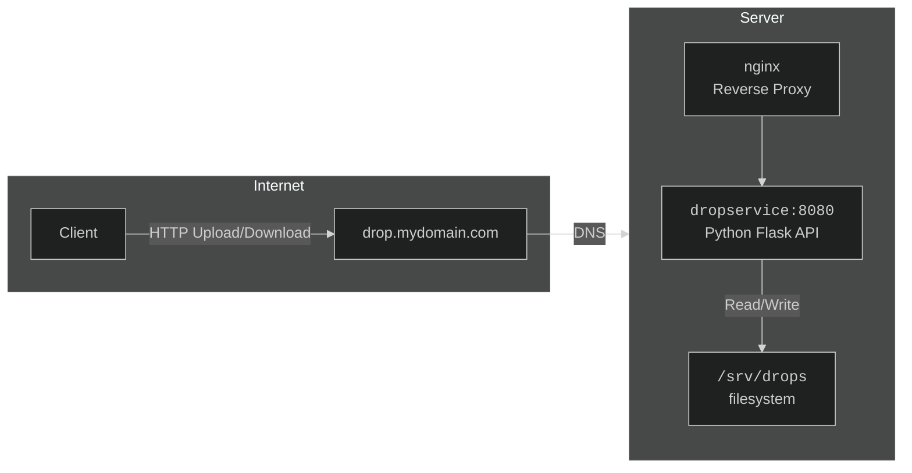

# dropservice

A rudimentary, lightweight, file send service for your internet server.

## Architecture



## Configuration

Copy `.env.example` to `.env` and adjust as needed:

```bash
cp .env.example .env
```

| Variable      | Default       | Description                        |
|---------------|---------------|------------------------------------|
| `UPLOAD_PATH` | `/srv/drops`  | Directory where uploads are stored |
| `PORT`        | `8080`        | Port the Flask server listens on   |

## Deploying

### Automated setup (recommended)

`setup.sh` handles everything on a Debian/Ubuntu server: installs dependencies, deploys the app to `/opt/dropservice`, configures systemd, obtains a TLS certificate via Cloudflare DNS challenge, and sets up nginx.

**Prerequisites:**
- A Cloudflare API token with **Zone → DNS → Edit** permission (scoped to the target zone)


#### Run the setup script

```bash
DOMAIN=drop.mydomain.com sudo -E ./setup.sh
```

### Manual setup

#### Local development

This project uses `uv` for dependency management:

```bash
curl -LsSf https://astral.sh/uv/install.sh | sh
uv sync
uv run python main.py
```

#### Filesystem

```bash
mkdir -p /srv/drops
chown www-data:www-data /srv/drops
```

#### systemd

Place the project at `/opt/dropservice`, then:

```ini
# /etc/systemd/system/drop.service
[Unit]
Description=File drop service
After=network.target

[Service]
WorkingDirectory=/opt/dropservice
EnvironmentFile=/opt/dropservice/.env
ExecStart=/opt/dropservice/.venv/bin/python main.py
Restart=always
User=www-data

[Install]
WantedBy=multi-user.target
```

```bash
systemctl enable --now drop
```

#### nginx

```nginx
server {
    listen 80;
    server_name drop.mydomain.com;
    return 301 https://$host$request_uri;
}

server {
    listen 443 ssl;
    server_name drop.mydomain.com;

    ssl_certificate     /etc/letsencrypt/live/drop.mydomain.com/fullchain.pem;
    ssl_certificate_key /etc/letsencrypt/live/drop.mydomain.com/privkey.pem;

    client_max_body_size 0;
    proxy_read_timeout 600;
    proxy_request_buffering off;

    location / {
        proxy_pass http://127.0.0.1:8080;
        proxy_set_header Host $host;
        proxy_set_header X-Real-IP $remote_addr;
    }
}
```

> If you change `PORT` in `.env`, update the `proxy_pass` port accordingly.
